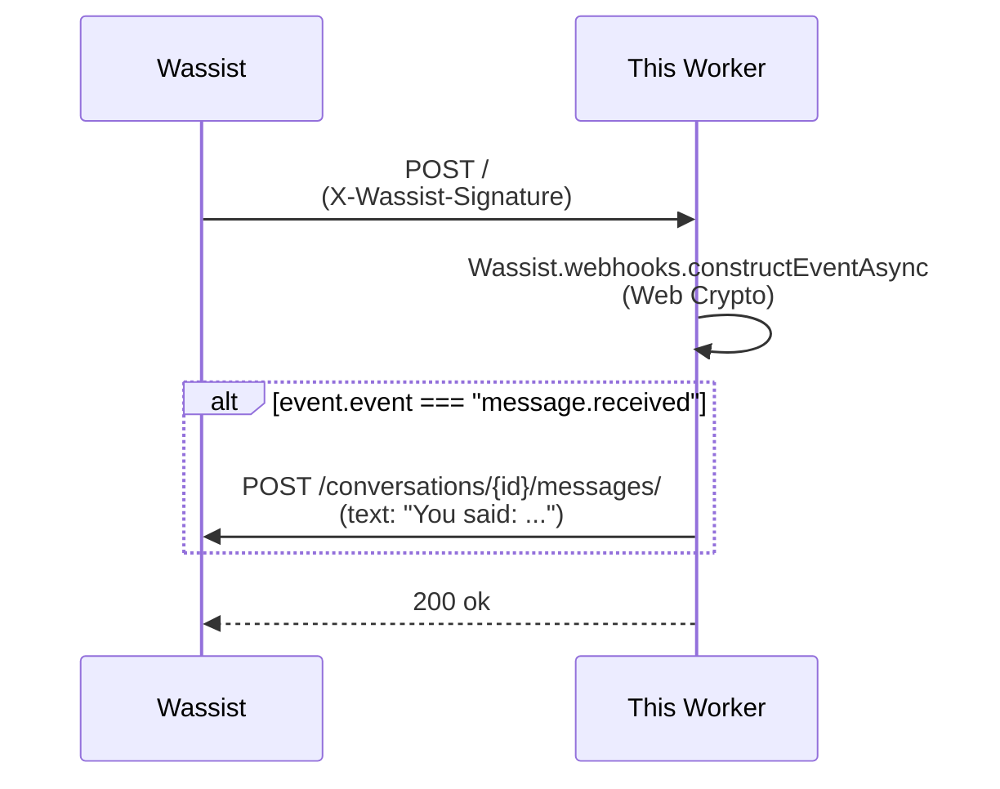

# webhook-receiver-cloudflare

A Cloudflare Worker that **verifies** incoming Wassist webhooks (using Web Crypto, no Node APIs) and **echoes** every inbound message back to the contact via `wassist.conversations.messages.send`.

The whole Worker is one file: [`src/worker.ts`](src/worker.ts).

## Deploy in one click

[](https://deploy.workers.cloudflare.com/?url=https://github.com/wassist/sdk/tree/main/examples/webhook-receiver-cloudflare&secrets=WASSIST_API_KEY,WASSIST_WEBHOOK_SECRET)

Cloudflare will fork the example repo, prompt you for `WASSIST_API_KEY` and `WASSIST_WEBHOOK_SECRET` (stored as encrypted secrets), and deploy the Worker. After it finishes, register

```
https://wassist-webhook-receiver.<your-subdomain>.workers.dev
```

as a webhook in the [Wassist dashboard](https://wassist.app/developers/webhooks).

## What it does



- `message.received` is echoed back to the contact.
- `subscription.activated` / `subscription.revoked` / `test.ping` are logged via `console.log`.
- Signature failures return `400`. Replay window: 300s (the SDK default).

## Run locally

```bash
cp .dev.vars.example .dev.vars
# Fill in WASSIST_API_KEY + WASSIST_WEBHOOK_SECRET.
npm install
npm run dev   # wrangler dev — runs on localhost:8787
```

Expose to the internet for end-to-end testing:

```bash
npx untun tunnel http://localhost:8787
# or use Cloudflare Tunnel, ngrok, etc.
```

Register the resulting URL with the Wassist dashboard.

## Deploy from the CLI

```bash
npm install
wrangler login
wrangler secret put WASSIST_API_KEY        # paste your key, hit enter
wrangler secret put WASSIST_WEBHOOK_SECRET # paste the secret, hit enter
npm run deploy
```

## Environment / secrets

| Name | Required | Description |
|------|----------|-------------|
| `WASSIST_API_KEY` | yes | API key used to send the echo reply (encrypted Wrangler secret). |
| `WASSIST_WEBHOOK_SECRET` | yes | Signing secret from the webhook you registered (encrypted Wrangler secret). |

## Notes

- The Worker uses `constructEventAsync`, which runs on `globalThis.crypto.subtle` — no `node:crypto`, no `nodejs_compat` bundle bloat needed for verification itself.
- The body is read **once** with `request.text()` and passed unchanged to verification. Don't `JSON.parse` it first — even whitespace differences break the HMAC.
- During SDK development you can swap the dependency to `"file:../.."` and re-run `npm install` to pull from the monorepo workspace instead of npm.

## License

MIT
